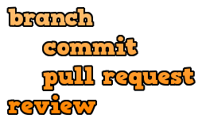

# How to Contribute

Click the following for more info:

1. [Write a new pattern](#writing-a-new-pattern)
2. [Discuss/Record early ideas](#discussing-early-ideas-in-issues)
3. [Add-to/Comment-on existing patterns in review](#interacting-with-patterns-reviews)
4. [Take part in our Meetings and Roles](/meta/meetings.md) <-- link to separate doc

# Where to Start...

First, checkout our complete list of patterns: [google doc](https://docs.google.com/spreadsheets/d/17KPZdCoquTnYSj03pX4v2vn8lrSYO_6HK20u1cwaLPg/edit#gid=0) OR [public github](https://github.com/paypal/InnerSourcePatterns#reviewed-patterns-proven-and-reviewed)

We encourage beginners seeking answers to jump in by creating `donuts` (filling in the problem, context, forces and resulting context fields but leaving the solution blank) as a way of asking the InnerSource Commons community for help (to find a proven solution or to brainstorm things to try). We encourage experts to pad their experience - these could easily become part of a book one day. Anyone can offer reviews and comments for [in-progress patterns](https://github.com/paypal/InnerSourcePatterns/pulls). 

We work together via Github, Webex, Slack, etc. Do not hesitate to join the [#innersourcecommons](https://isc-inviter.herokuapp.com/) or #innersource-patterns slack channels and ask to be included in the [patterns meetings](/meta/meetings.md) (there is an email list).

# Writing a New Pattern

The below steps can be used to create a new `donut`, `idea`, or complete pattern. The use-case here is that you have a relatively thought-out idea or problem in your head and can confidently fill out the barest of pattern fields. If you are unsure your idea is ready for this, [discuss it in an issue first](#discussing-early-ideas-in-issues).

The simplest way to create a pattern is with your browser:

1. Assure you are logged into Github & go to the [patterns web repo](https://github.com/paypal/InnerSourcePatterns)
2. Click on the 'Create new file' button
3. Name the file like this example: "project-management-time-pressures.md"
4. Use the [pattern template](https://raw.githubusercontent.com/paypal/InnerSourcePatterns/master/meta/pattern-template.md) to create your new [markdown](/meta/markdown-info.md) file with the description of the _idea_, _donut_, or _pattern_
5. Propose this new file and then also create a Pull Request (PR)

This creates a separate branch and creates a Pull Request (PR) all in one fell swoop!

You can also utilize git's native command line instead: [we have separate technical instructions here](/meta/technical-git-howto.md).

# Discussing Early Ideas in Issues

FIXME: Content needs to be created (by Daniel Izquierdo??)

* "for early discussions go to issues, you can click there, and then open a new issue here, please use the label `idea` and try to be concise with the context, so we can point to others if needed"
* "Context is basically a description of the issue they may face in their organization"

# Interacting with Patterns Reviews

FIXME: The below content is wrong for this section. Content for this section needs to be written, and the below content needs to be integrated elsewhere (it has some useful info).

The basic steps below can be thought of as *branch*, *commit*, *pull request*, and *review*.

1. [Create an issue](https://github.com/paypal/InnerSourcePatterns/issues) for each new idea, donut or pattern. The issue should:
  * contain a title of the pattern in format ex: ``pattern/badly-named-piles``
  * contain a short description (at least the problem) and
  * be labeled with the appropriate label (_idea_, _donut_, _pattern_)
2. Create a new branch either in your browser, clone, or fork of the
  [patterns repository][patternsRepo]. Please use the similar convention for
  naming branches: `pattern/<pattern-name>`. Example:
  `pattern/contracted-contributor`.
3. Create a [Markdown](/meta/markdown-info.md) file with the description of the _idea_, _donut_ or
  _pattern_ and store it in the main directory. Commit and push.
4. Once your contribution is ready to be reviewed, create a pull request (PR)
  targeted at `master` and label it with _pattern_. Additionally decide whether
  to label it with _idea_, _donut_, or _draft_ and _Ready for Review_ or _Incomplete_
5. Reviewers can now use the PR features to comment on the pattern.
6. In case of required rework, the author should apply the labels
  _Ready for Additional Review_ and/or _Revised_ to indicate that a 2nd review is requested.
7. After reviews are complete, the reviewers or author should remove the label
  _Ready for Review_ and label the pattern _Accepted_.
8. Once a pattern is labeled _Accepted_ by the reviewers, one of the TCs of the
  [patterns repository][patternsRepo] will then move the pattern to either the
  `ideas`, `donuts` or `patterns` subdirectories, merge it to `master` and
  close the associated issue.

When completed patterns (reviewed and accepted) are ready to be published from this InnerSourcePatterns repo to the InnerSourceCommons repo, [see our seperate PUBLISHING.md instructions](PUBLISHING.md).

If you would like [technical command-line instructions, see here](/meta/technical-git-howto.md).

[commons]: http://innersourcecommons.org
[patternsRepo]: https://github.com/paypal/InnerSourcePatterns
[commonsRepo]: https://github.com/paypal/InnerSourceCommons
